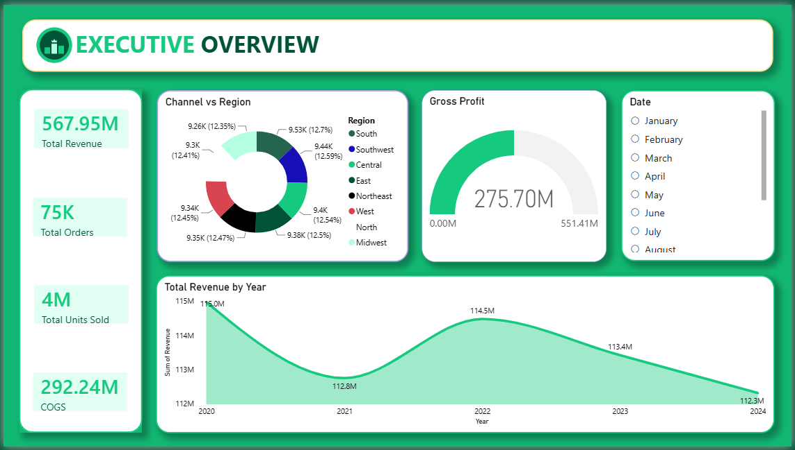
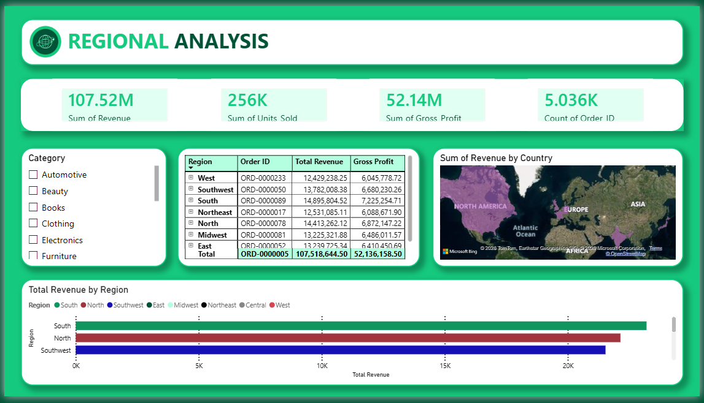
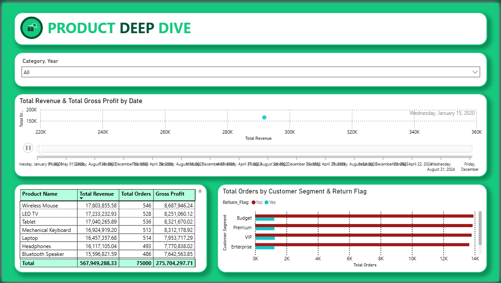
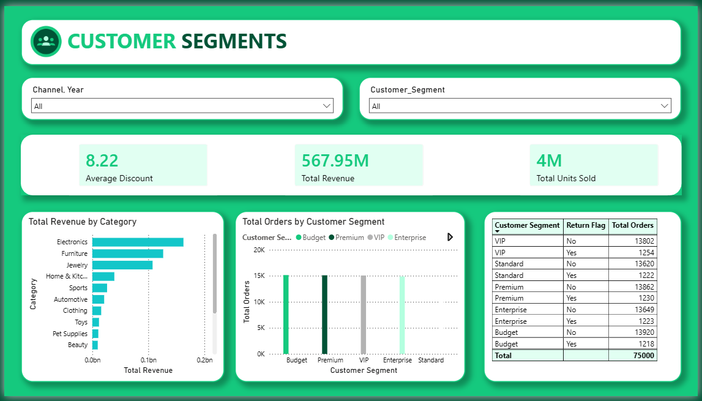
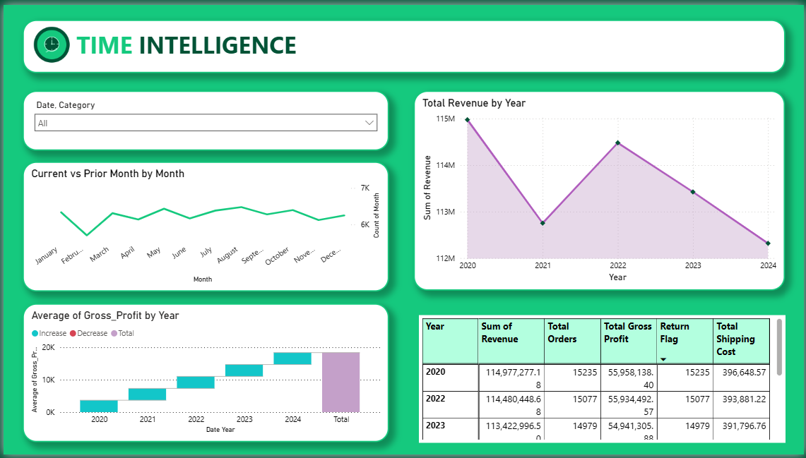

🛒 E-Commerce Sales Analytics Dashboard

📌 Project Overview

This project is an interactive E-Commerce Sales Analytics Dashboard developed using Power BI to analyze sales performance, customer behavior, product performance, regional trends, and business profitability.

The dashboard provides a comprehensive view of key business metrics and enables stakeholders to make data-driven decisions through interactive visualizations and dynamic filtering.

🎯 Project Objectives
Analyze overall business performance.
Monitor revenue, profit, orders, and units sold.
Identify top-performing products and categories.
Understand customer purchasing behavior.
Compare regional sales performance.
Track yearly and monthly sales trends.
Support strategic business decision-making.

🛠️ Tools & Technologies Used
Power BI Desktop
Power Query
DAX (Data Analysis Expressions)
Microsoft Excel / CSV Dataset
Data Modeling
Interactive Visualizations

📊 Dashboard Pages

1️⃣ Executive Overview

Provides a high-level summary of business performance.

Key Metrics
Total Revenue: 567.95M
Total Orders: 75K
Total Units Sold: 4M
COGS: 292.24M
Gross Profit: 275.70M
Visuals
Revenue by Sales Channel
Gross Profit Gauge
Revenue Trend by Year
Monthly Filters

2️⃣ Sales Performance

Analyzes sales across channels, categories, and years.

Insights Covered
Revenue by Product Category
Revenue & Gross Profit Comparison
Units Sold by Region
Revenue Distribution Across Categories
Channel-wise Sales Analysis
Filters
Sales Channel
Year

3️⃣ Regional Analysis

Provides geographical sales performance insights.

Key Metrics
Revenue by Region
Gross Profit by Region
Orders by Region
Units Sold by Region
Visuals
Geographic Revenue Map
Region Performance Table
Revenue by Region Bar Chart
Business Value

Helps identify high-performing and underperforming regions.

4️⃣ Product Deep Dive

Focused analysis of product-level performance.

Insights Covered
Top Products by Revenue
Gross Profit by Product
Orders by Product
Customer Return Analysis
Revenue vs Profit Trend
Business Value

Identifies best-selling and most profitable products.

5️⃣ Customer Segments

Analyzes customer groups and purchasing patterns.

Metrics
Average Discount
Total Revenue
Total Units Sold
Insights Covered
Revenue by Category
Orders by Customer Segment
Return Behavior Analysis
Segment-wise Performance
Segments
Budget
Premium
VIP
Enterprise
Standard

6️⃣ Time Intelligence

Tracks business performance over time.

Insights Covered
Year-over-Year Revenue Growth
Monthly Sales Trends
Current vs Previous Month Analysis
Gross Profit Trend Analysis
Revenue & Order Comparison
Business Value

Supports forecasting and trend identification.

📈 Key Business Insights
Revenue Performance
Total Revenue generated: 567.95M
Revenue remained relatively stable between 2020–2024.
Profitability
Gross Profit reached 275.70M.
Gross Margin is approximately 48.5%.
Regional Performance
Southern and Northern regions generated the highest revenue.
Revenue distribution is fairly balanced across regions.
Product Performance
Electronics category contributed the highest revenue.
Wireless Mouse and LED TV were among the top-performing products.
Customer Behavior
Premium and VIP segments generated significant order volume.
Return rates remained relatively low across customer segments.

🔍 Features

✅ Interactive Filters (Slicers)

✅ Drill-Down Analysis

✅ Multi-Page Navigation

✅ KPI Cards

✅ Time Intelligence Calculations

✅ Geographic Mapping

✅ Dynamic Visualizations

✅ Profitability Analysis

📂 Dataset Information

The dataset contains:

Orders
Products
Categories
Customers
Regions
Channels
Revenue
Gross Profit
Discounts
Shipping Cost
Return Information

📸 Dashboard Preview

🚀 Learning Outcomes

Through this project, I gained hands-on experience in:

Power BI Dashboard Development
Data Cleaning and Transformation
Data Modeling
DAX Measures & Calculated Columns
KPI Design
Business Intelligence Reporting
Data Storytelling
Interactive Dashboard Design

👨‍💻 Author
Himanshu Devgan
B.Tech (Computer Engineering)
Data Analytics Trainee
Skills: Power BI, Python, Excel
